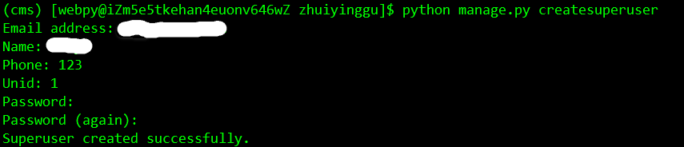
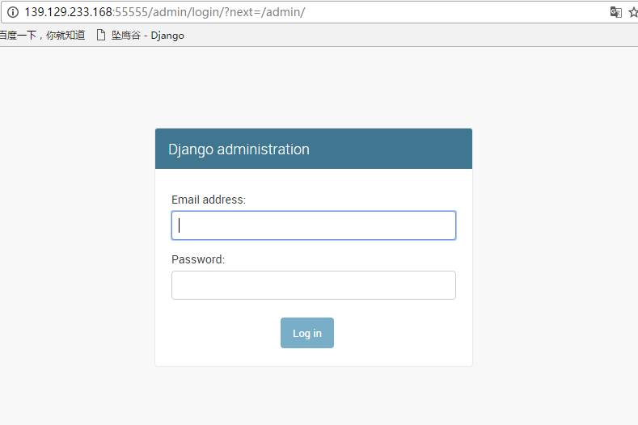
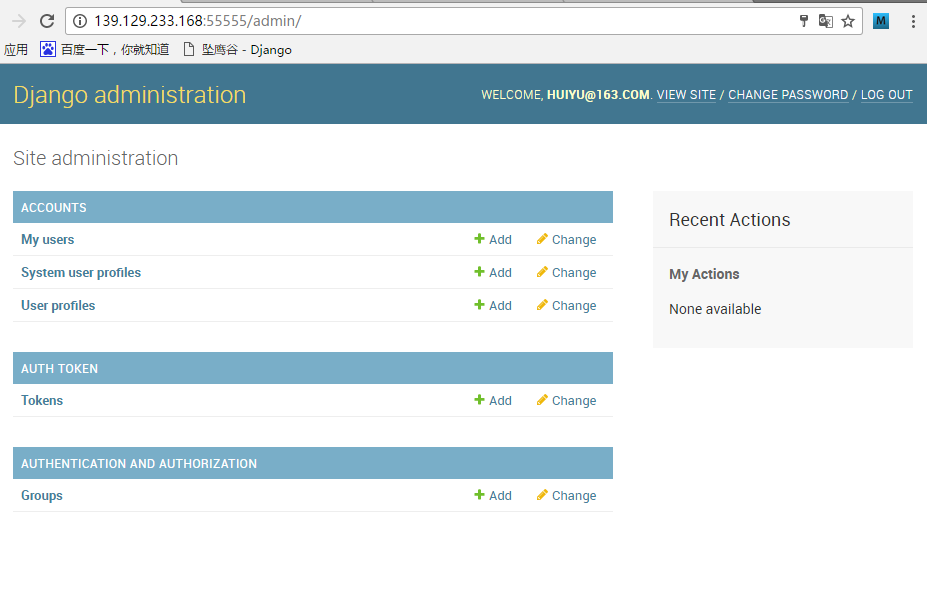

# 一、 启动Django服务

## 1. 启用cms虚拟环境：

    $ source /usr/local/python34/bin/virtualenvwrapper.sh
    $ workon cms

## 2. 创建管理界面的后台管理员：

    python manage.py createsuperuser

## 3. 启动Django服务：

    $ python manage.py runserver 139.129.233.168:55555

 

